<!-- <p align="center">
    
<p> -->
<h2 align="center"> Knowing the Self, Understanding the World: A Dual-Cognition Benchmark for UAV Spatio-temporal Reasoning with MLLMs</h2>
<!-- {: width="50%"} -->
<!--  -->
<div align="center">
<!-- </img> -->


_**[Like Liu](https://likeliu.com), Zhengzheng Xu, Haitao He, Hongzhe Li, Shuchang Zhang, [Dian Shao](https://scholar.google.com/citations?user=amxDSLoAAAAJ&hl=en)<sup>†</sup>**_
<br><br>
<sup>†</sup>Corresponding Author
<br>
Northwestern Polytechnical University

<h5 align="center"> If you like our project, please give us a star ⭐ on GitHub for latest update.  </h2>
 <a href='https://arxiv.org/abs/2607.16193'></a> &nbsp;
 <a href='https://uav-dualcog.lozumi.com/'></a> &nbsp; 
 <a href='https://www.modelscope.cn/datasets/Lozumi/UAV-DualCog'></a> &nbsp; 
<br>
<strong>The 40th Annual AAAI Conference on Artificial Intelligence (AAAI-26)</strong>
</div>

<p align="center">
  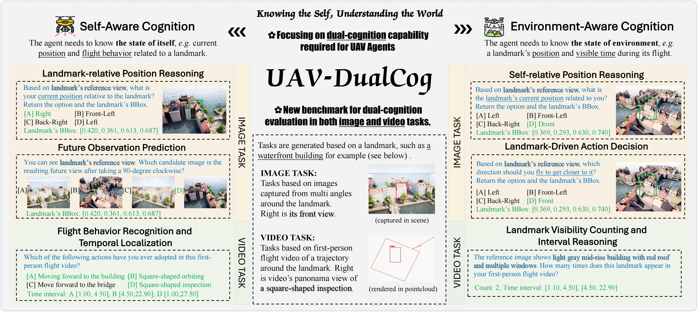
</p>
<p align="center"><em>UAV-DualCog benchmark overview. The benchmark organizes self-aware and environment-aware reasoning across image and video tasks, and the released code package supports the corresponding Stage 1-4 construction and evaluation workflow.</em></p>

- Website: https://uav-dualcog.lozumi.com/
- Code repo: https://github.com/SmartDianLab/UAV-DualCog
- Dataset (ModelScope): https://www.modelscope.cn/datasets/Lozumi/UAV-DualCog
- Dataset (Hugging Face): https://huggingface.co/datasets/Lozumi/UAV-DualCog (preparing)
- AerialVLN simulator: https://www.kaggle.com/datasets/shuboliu/aerialvln-simulators

For benchmark definitions, leaderboard interpretation, and detailed supplementary explanations, please read the website pages in order: Home -> Benchmark -> Construction -> Evaluation -> Leaderboard -> Analysis -> Usage.

## 1) What Is Included

- `scripts/uav_dualcog/`: Stage 1-4 entrypoints, pipeline orchestrator, shared utilities.
- `trajectory/`: hierarchical atomic/composite behavior library and composition logic.
- `sim_bridge/`: simulator abstraction and AirSim bridge.
- `configs/uav_dualcog/`: 18 runnable per-scene configs + shared configs + task-pipeline spec.
- `configs/uav_dualcog/templates/`: fully commented templates for customization.
- `configs/prompts/uav_dualcog_prompts.yaml`: Stage 2-4 prompt package.
- `environment.yml`, `requirements.txt`, `deps/`: environment/dependency references.

## 2) What Is Excluded

- No private keys or private endpoints.
- No generated artifacts (`scene_data/`, `task_pipeline_data/`, caches, media outputs).
- No internal notes/workflow docs outside public release scope.

Note:
- Environment setup records and Stage 1-4 empirical run logs in this package are provided under `logs/`.

## 3) Full Workspace Structure (Code + Env + Data + Outputs)

```text
UAV-DualCog/
├── scripts/uav_dualcog/                        # Stage 1-4 + task_pipeline entrypoints
├── trajectory/                                  # behavior elements/sets and composition
├── sim_bridge/                                  # AirSim bridge and engine adapter layer
├── configs/
│   ├── uav_dualcog/
│   │   ├── task_airsim_env_<id>.yaml           # runnable scene configs (18 scenes)
│   │   ├── common_stage_configs.yaml            # behavior library and shared stage defaults
│   │   ├── common_api_runtime.yaml              # model routing (API + local deployment)
│   │   ├── task_pipeline/
│   │   │   └── task_pipeline_uav_dualcog_v1.yaml
│   │   └── templates/                           # fully-commented config templates
│   └── prompts/
│       └── uav_dualcog_prompts.yaml
├── envs/                                        # simulator env assets (download separately)
│   └── airsim/
│       └── env_7/
├── scene_data/                                  # Stage 1-2 outputs
│   └── airsim_env_7/
│       ├── pcd_map/
│       ├── landmarks_raw/
│       └── landmarks_review/
├── task_pipeline_data/                          # Stage 3-4 outputs
│   └── UAV-DualCog-V1/
│       ├── airsim_env_7/
│       │   ├── video_tasks/
│       │   └── image_tasks/
│       └── task_pipeline/
│           ├── dataset_stats/
│           ├── exports/
│           └── landmark_lists/
├── environment.yml                              # conda environment reference
├── requirements.txt
└── deps/
```

## 4) Two Reproduction Modes

### Mode A: Data Construction (Stage 1-4)

Use this when reproducing benchmark construction from scene/simulator inputs.

Requires:
- `envs/airsim/env_*` simulator files.
- writeable `scene_data/` and `task_pipeline_data/`.
- stage configs + prompt package.

Recommended workflow:
1. Stage 1 collects and fuses scene point clouds.
2. Stage 2 collects landmark candidates and performs review/auto-labeling.
3. Stage 3 generates behavior-driven video tasks.
4. Stage 4 generates image tasks and evaluation manifests.

Important operational notes:
- Stage 2 Step 2-4 are completed in the internal review web (`review_instances_web` + auto-label flow).
- Stage 3 and Stage 4 both provide internal web workbenches for inspection (behavior library, landmark/task previews, experiment outputs), but for released split generation we recommend `task_pipeline.py` batch phases.
- Some operations are available in both CLI and web forms. In practice, we recommend:
  - **Stage 2**: use the internal review web for Step 2-4 (screening, representative main-view confirmation, single-direction anchoring, auto-label review).
  - **Stage 3 / Stage 4**: use `task_pipeline.py` for released-scale batch generation, and use the internal web mainly for visual inspection, prompt/debug checks, and experiment/result browsing.

### Mode B: Experiment Only (No Scene Reconstruction)

Use this when you only evaluate models on released benchmark assets.

Requires:
- downloaded `scene_data/airsim_env_*` release (for scene/landmark context).
- downloaded `task_pipeline_data/UAV-DualCog-V1` release.
- no simulator environment files needed.
- `common_api_runtime.yaml` configured (API or local).

## 5) Model Invocation Methods

`configs/uav_dualcog/common_api_runtime.yaml` supports:

1. **API routing** (`api_source: cloud/openrouter/...`)  
   Call remote OpenAI-compatible endpoints.
2. **Local deployment** (`api_source: local`)  
   Call local OpenAI-compatible serving endpoints.  
   The release package assumes local models are used as deployed, with no additional quantization handling logic in this code package.

### 5.1 Instant / Thinking Suffix Rules

Experiment model names can carry one runtime suffix:

- `-Instant`: force non-thinking style request controls where supported.
- `-Thinking` (or `-Reasoning`): force thinking/reasoning controls where supported.

Examples:

- `Qwen/Qwen3.5-9B-Instant`
- `Qwen/Qwen3.5-9B-Thinking`
- `OpenGVLab/InternVL3_5-4B-Instant`

Important behavior:

- The suffix is a **request-mode switch**, not a new routing key.
- Routing is resolved on the **base model name** in `common_api_runtime.yaml` (suffix stripped).
- Different providers/families expose different control knobs (`enable_thinking`, `reasoning`, `chat_template_kwargs`, etc.), and the runtime maps suffixes to family-compatible controls automatically.
- If a model family does not support a specific toggle, the runtime keeps a safe no-op behavior instead of rewriting benchmark semantics.

### 5.2 vLLM Local Deployment (Example)

For vLLM environment setup, use the official quickstart:

- https://docs.vllm.com.cn/en/latest/getting_started/quickstart/#installation

Example model download (ModelScope):

```bash
modelscope download --model Qwen/Qwen3.5-4B --local_dir ./models/qwen3_5-4b
```

Example local serving command:

```bash
export CUDA_VISIBLE_DEVICES=3
export VLLM_USE_MODELSCOPE=true

vllm serve \
  ./models/internvl3_5-4b \
  --served-model-name OpenGVLab/InternVL3_5-4B-Instant \
  --tensor-parallel-size 1 \
  --reasoning-parser qwen3 \
  --max-model-len 32K \
  --kv-cache-dtype fp8 \
  --gpu-memory-utilization 0.90 \
  --max-num-seqs 8 \
  --max-num-batched-tokens 16K \
  --enable-prefix-caching \
  --host 0.0.0.0 \
  --port 40900
```

Recommended alignment:

- Keep `--served-model-name` consistent with the model alias used in experiments.
- Keep `common_api_runtime.yaml -> api.models.<base_model>.request_model` consistent with your served model name.

For safe dry checks (no real model calls), run:

```bash
python scripts/uav_dualcog/api_common.py --help
python scripts/uav_dualcog/mock_api_runtime_check.py --config configs/uav_dualcog/common_api_runtime.yaml
```

## 6) Config Files You Should Edit

Fully commented templates are in:

- `configs/uav_dualcog/templates/scene_config.template.yaml`
- `configs/uav_dualcog/templates/common_stage_configs.template.yaml`
- `configs/uav_dualcog/templates/common_api_runtime.template.yaml`
- `configs/uav_dualcog/templates/task_pipeline.template.yaml`

Runnable examples are already provided under (env_7 shown here):

scene_id values are recommended to use the canonical `env_<id>` format throughout configs and commands.
If `--scene-id` is passed on the command line, keep it identical to `task.scene_id` in the config; do not mix forms such as `7` and `env_7` within one workspace.

- `configs/uav_dualcog/task_airsim_env_7.yaml`
- `configs/uav_dualcog/common_stage_configs.yaml`
- `configs/uav_dualcog/common_api_runtime.yaml`
- `configs/uav_dualcog/task_pipeline/task_pipeline_uav_dualcog_v1.yaml`

### 6.1 Scene Config (env_7 runnable example)

```yaml
# configs/uav_dualcog/task_airsim_env_7.yaml
task:
  name: UAV-DualCog-env_7
  engine: airsim
  base_dir: scene_data
  scene_id: env_7
  scene_dir_name: airsim_env_7

output_layout:
  scene_dir_include_engine: true
  stage1_dir: pcd_map
  stage2_raw_dir: landmarks_raw
  stage2_review_dir: landmarks_review
  stage3_task_root_dir: video_tasks      # released Stage 3 root
  stage4_qa_dir: image_tasks             # released Stage 4 root

camera:
  width: 4096                            # source capture resolution (DCI 4K 4:3)
  height: 3072
  fov: 72.0                              # camera FoV in degrees
  fps: 10                                # source-frame sampling rate

collect:
  pose_settle_sec: 0.05                  # wait after pose set before capture

traj_map:
  VoxelWidth: 1.5                        # map voxel/grid size in meters
  LidarDelta: [30, 30, 50]               # LiDAR local sampling span (x,y,z) in meters
  MapBound: [-219, 191, -270, 268, -50, 52]

parallel:
  mode: single_instance_multi_thread     # one AirSim process + multi-thread collection
  workers: 6

stage2:
  collect_rgb_views_count: 8             # side views per landmark (top view controlled separately)
  collect_parallel_workers: 6
  collect_rgb_parallel_workers: 6
  collect_view_image_width: 4096
  collect_view_image_height: 3072

engine_params:
  airsim:
    sim_ip: 127.0.0.1
    sim_port: 41070
    launch_sim: true
    headless: true
    camera_name: front_0
    vehicle_name: drone_1
    lidar_range: 500.0                   # LiDAR max range (meters)
    lidar_points_per_second: 200000
```

### 6.2 Common Stage Config (behavior library; runnable)

```yaml
# configs/uav_dualcog/common_stage_configs.yaml
stage3_behavior_library:
  shared:
    safety_distance_m: 2.0               # global safety clearance for trajectory generation
  elements:
    gradual_approach:
      display_name: Gradual Approach
      family: inspection
      camera_mode_default: landmark_track
      params:
        travel_distance_m: {min: 30, max: 120, default: 40, step: 10}
        descent_m: {min: 5, max: 40, default: 15, step: 5}
    circular_orbit:
      display_name: Circular Orbit
      family: orbit
      camera_mode_default: landmark_track
      params:
        extension_m: {min: 4, max: 36, default: 12, step: 2}
        arc_deg: {min: 45, max: 720, default: 180, step: 90}
```

### 6.3 API Runtime Config (runnable)

```yaml
# configs/uav_dualcog/common_api_runtime.yaml
api:
  default_models:
    stage2: Qwen/Qwen3.5-9B
    stage3: openai/gpt-5.3-chat
    stage4: Qwen/Qwen3.5-4B
  models:
    openai/gpt-5.3-chat:
      api_source: cloud
      api_base: ${UAV_DUALCOG_API_BASE}
      api_key: ${UAV_DUALCOG_API_KEY}
      request_model: gpt-5.3-chat
      rpm_limit: 60
      tpm_limit: 200000
    Qwen/Qwen3.5-9B:
      api_source: local
      api_base: http://127.0.0.1:28000/v1
      api_key: ${UAV_DUALCOG_LOCAL_API_KEY}
```

### 6.4 Task Pipeline Spec (runnable)

```yaml
# configs/uav_dualcog/task_pipeline/task_pipeline_uav_dualcog_v1.yaml
task_name: UAV-DualCog-V1
task_pipeline_root_dir: task_pipeline_data
stage: both
phase: both
scene_ids: [env_7, env_8, env_9, env_10, env_11, env_13, env_16, env_17, env_20, env_21, env_23, env_24]
seed: 29

stage3:
  final_video_width: 1440                # released video resolution (1080P, 4:3)
  final_video_height: 1080
  final_capture_parallel_workers: 16
  record_parallel_workers: 16

stage4:
  env_capture_parallel_workers: 8
  overlay_parallel_workers: 32
  difficulties: [4way, 8way]
```

### 6.5 Parameter Impact Notes (efficiency vs quality)

- **Resolution (`camera.width/height`, `collect_view_image_width/height`)**: higher values improve fine-grained landmark geometry and bbox tightness, but increase capture latency, I/O pressure, and web rendering time.
- **FoV (`camera.fov`)**: smaller FoV gives larger target scale but weaker context; larger FoV gives stronger context but more perspective distortion. `72` is the current balance used by release generation.
- **LiDAR radius (`engine_params.airsim.lidar_range`, `traj_map.LidarDelta`)**: larger range/span increases scene coverage and far-object context, but increases point volume and fusion cost.
- **Grid size (`traj_map.VoxelWidth`)**: smaller voxel width keeps finer geometry but increases memory/time; larger voxel width is faster but can blur small structures.
- **Parallel collection (`parallel.workers`, `stage2.collect_parallel_workers`, `stage2.collect_rgb_parallel_workers`)**: thread-level parallelism improves throughput under one simulator process, but oversubscription can cause black frames or unstable capture timing.
- **Frame rate (`camera.fps`, Stage-3 render fps settings)**: higher fps preserves motion detail and temporal labels better, but increases storage, transfer, and inference overhead.

### 6.6 Runtime Baseline Used For These Example Parameters

The runnable defaults above are tuned for the current build machine:

- CPU: `2 x AMD EPYC 7452` (128 vCPUs total)
- RAM: `503 GiB`
- GPU: `4 x NVIDIA GeForce RTX 4090 (24 GB each)`

Important:

- In our tests, **AirSim only runs reliably in a single process per scene pipeline**.
- Therefore Stage 1/2 collection uses **single-process, multi-thread** capture (`single_instance_multi_thread`) instead of multi-process simulator launching.

## 7) Executable Steps (Mode A: Construction)

Below uses `env_7` as example scene.

### Step 0. Environment

```bash
conda env create -f environment.yml
conda activate uav-dualcog
```

If your server does not have a display device, you may need:

```bash
sudo apt install xdg-user-dirs xdg-utils
sudo apt install libegl1
sudo apt install vulkan-tools libvulkan1 mesa-vulkan-drivers
```

Environment setup records and Stage 1-4 empirical logs are available in:

```text
logs/
```

### Step 1. Stage 1 (Point Cloud Collection + Fusion)

Purpose: build segmented/fused scene cloud for landmark construction.

1.0 Probe and write back scene map bounds (recommended before large collection):

```bash
python scripts/uav_dualcog/probe_airsim_mapbound.py \
  --config configs/uav_dualcog/task_airsim_env_7.yaml \
  --scene-id env_7 \
  --workers 6 \
  --probe-source hybrid \
  --write-back \
  --output scene_data/airsim_env_7/pcd_map/mapbound_probe_env7.json
```

This step estimates robust `traj_map.MapBound`, `EstimatedSurfaceZ`, and related boundary fields
for the current scene, then writes them back to the scene config for stable Stage 1 collection.

```bash
python scripts/uav_dualcog/stage1_collect_pcd.py \
  --config configs/uav_dualcog/task_airsim_env_7.yaml \
  --scene-id env_7 \
  --mode all \
  --engine airsim
```

### Step 2. Stage 2 (Landmark Construction + Review + Auto-Label)

Purpose: construct landmark instances and finalize reviewed semantic annotations.

2.1 Collect candidates and multiview evidence:
```bash
python scripts/uav_dualcog/stage2_landmark_label.py \
  --config configs/uav_dualcog/task_airsim_env_7.yaml \
  --scene-id env_7 \
  --mode collect_instances
```

2.2 Open review web (Step 2-4 are web-centered in practice):
```bash
python scripts/uav_dualcog/stage2_landmark_label.py \
  --config configs/uav_dualcog/task_airsim_env_7.yaml \
  --scene-id env_7 \
  --mode review_instances_web \
  --host 0.0.0.0 \
  --port 20261
```

2.3 Auto-label reviewed instances:
```bash
python scripts/uav_dualcog/stage2_landmark_label.py \
  --config configs/uav_dualcog/task_airsim_env_7.yaml \
  --scene-id env_7 \
  --mode auto_label
```

### Step 3. Stage 3 (Video Task Construction)

Purpose: generate missions/trajectories, render videos, build stage3 manifests.

Direct entrypoint:
```bash
python scripts/uav_dualcog/stage3_generate_traj.py --help
```

Recommended (batch/reproducible) pipeline phases:
```bash
python scripts/uav_dualcog/task_pipeline.py \
  --spec configs/uav_dualcog/task_pipeline/task_pipeline_uav_dualcog_v1.yaml \
  --stage stage3 --phase selection

python scripts/uav_dualcog/task_pipeline.py \
  --spec configs/uav_dualcog/task_pipeline/task_pipeline_uav_dualcog_v1.yaml \
  --stage stage3 --phase data

python scripts/uav_dualcog/task_pipeline.py \
  --spec configs/uav_dualcog/task_pipeline/task_pipeline_uav_dualcog_v1.yaml \
  --stage stage3 --phase render
```

Optional internal web workbench:
```bash
python scripts/uav_dualcog/stage3_generate_traj.py \
  --config configs/uav_dualcog/task_airsim_env_7.yaml \
  --scene-id env_7 \
  --mode web
```

### Step 4. Stage 4 (Image Task Construction)

Purpose: sample image QA tasks, render assets, export stage4 manifests.

Recommended pipeline phases:
```bash
python scripts/uav_dualcog/task_pipeline.py \
  --spec configs/uav_dualcog/task_pipeline/task_pipeline_uav_dualcog_v1.yaml \
  --stage stage4 --phase selection

python scripts/uav_dualcog/task_pipeline.py \
  --spec configs/uav_dualcog/task_pipeline/task_pipeline_uav_dualcog_v1.yaml \
  --stage stage4 --phase data

python scripts/uav_dualcog/task_pipeline.py \
  --spec configs/uav_dualcog/task_pipeline/task_pipeline_uav_dualcog_v1.yaml \
  --stage stage4 --phase render
```

Optional internal web workbench:
```bash
python scripts/uav_dualcog/stage4_qa_generate_and_eval.py \
  --config configs/uav_dualcog/task_airsim_env_7.yaml \
  --scene-id env_7 \
  --mode web \
  --port 20264
```

## 8) Internal Web Workspaces (Stage 2-4)

The internal web tools are designed for **interactive inspection, review, and run-level debugging**.
They are especially useful when you need to confirm whether geometry, views, prompts, task rows, or
model outputs are qualitatively correct before launching large batches.

Recommended split:
- **Stage 2 web** is the primary interface for Step 2-4 landmark review and semantic finalization.
- **Stage 3 / Stage 4 web** are best treated as workbenches for visual validation, targeted reruns,
  and experiment/result browsing.
- **Released-scale generation** should still be driven by `task_pipeline.py` so selection, data
  export, render, and experiment phases remain reproducible.

### 8.1 Stage 2 Web: Landmark Review And Auto-Label

Launch:

```bash
python scripts/uav_dualcog/stage2_landmark_label.py \
  --config configs/uav_dualcog/task_airsim_env_7.yaml \
  --scene-id env_7 \
  --mode review_instances_web \
  --host 0.0.0.0 \
  --port 20261
```

This web is the operational center of **Stage 2 Step 2-4**. It combines:
- left-side landmark list and progress counters,
- top-down point-cloud and RGB evidence panes,
- the eight-view RGB direction ring,
- auto-label fields,
- final semantic review fields.

Typical usage order:
1. **Step 2 initial screening**  
   Use `Drop` immediately for unstable or clearly unusable candidates. Use `Keep` only after the
   landmark has a confirmed main view and one confirmed landmark-centric direction anchor.
2. **Main-view confirmation**  
   In the eight-view RGB panel, select the most representative RGB view as the main view. The
   main view does **not** need to be `front`; it is simply the clearest and most benchmark-facing
   reference image for that landmark.
3. **Single-direction confirmation**  
   Reviewers only need to assign one correct direction anchor for the chosen main view. The
   remaining seven directions in the fixed ring order
   (`front`, `front_right`, `right`, `back_right`, `back`, `back_left`, `left`, `front_left`)
   are then derived automatically from that anchor rather than edited one by one.
4. **Invalid-view cleanup**  
   Mark strongly occluded or unusable RGB views as invalid. These views should not survive as
   reviewed evidence just because they were captured geometrically.
5. **Class-name synchronization**  
   If the weak class hint is not suitable, edit `class_name` before auto-labeling so the prompt
   receives a cleaner prior.
6. **Auto-label execution**  
   Run auto-label by current landmark, by class, or globally. The web exposes all three actions:
   `Single`, `By Class`, and `All`.
7. **Auto-label review**  
   Inspect `auto_label_category`, `auto_label_subcategory`, `auto_label_description`, and
   confidence. If the proposal is good, use `Approve Auto Label`; otherwise edit the final
   semantic fields manually.
8. **Manual correction and save**  
   Final reviewed fields are `landmark_category`, `landmark_subcategory`, and
   `landmark_description`. Save manual fixes if the automatic suggestion is incomplete or wrong.

Important page areas:
- **Left landmark list**  
  Shows class grouping, review status, and auto-label status so reviewers can move through one
  semantic group at a time.
- **Point-cloud evidence area**  
  Use this area to confirm that the candidate remains geometrically coherent and is not a
  fragmented or unstable instance.
- **Eight-view RGB area**  
  Use this area to confirm the representative image, one direction anchor, and invalid-view
  removal.
- **Auto-label controls**  
  Use these controls to start, monitor, cancel, or clear annotation jobs.
- **Final semantic fields**  
  Use these fields to publish the reviewed landmark semantics that later prompt templates depend on.

Artifacts written during this workflow:
- `landmarks_review/<scene>.valid_instances.json`
- `landmarks_review/<scene>.review_log.jsonl`
- `landmarks_review/auto_label_debug/` (when debug export is enabled)

<p align="center">
  
</p>
<p align="center"><em>Stage 2 internal review workspace. Point-cloud evidence, multiview RGB evidence, review-state controls, and auto-label approval are combined here so that Stage 2 Step 2-4 can be completed in one continuous workflow.</em></p>

### 8.2 Stage 3 Web: Mission Review, Dataset Browsing, And Experiment Tracking

Launch:

```bash
python scripts/uav_dualcog/stage3_generate_traj.py \
  --config configs/uav_dualcog/task_airsim_env_7.yaml \
  --scene-id env_7 \
  --mode web
```

The Stage 3 workbench exposes a multi-page mission and task interface. The main pages are:
- `Behavior Library`
- `Missions`
- `Review`
- `Generate`
- `Dataset`
- `Experiments`
- `Results`
- `Metrics`

Before treating a page as empty, first switch the top-right scene, task, mission, or manifest
selector. Several Stage 3 pages only populate after an active selection is made.

Recommended use of each page:

**Behavior Library**
- Inspect composite classes, atomic classes, parameter ranges, and defaults.
- Use this page to understand which atomic maneuvers a composite template expands into before
  trajectory generation.

**Missions**
- Select target landmarks and configure mission mode, generation count, template selection rule,
  and optional atomic overrides.
- Generate panorama/preview media first, then regenerate preview or final task video when needed.
- Use this page for **interactive mission prototyping** and for checking whether a landmark is well
  matched to the intended composite or atomic behavior.

**Review**
- Browse generated candidate missions and mark them as approved, pending, or rejected.
- Use this page to remove visually poor or semantically ambiguous missions before they are turned
  into task rows.

**Generate**
- Convert approved candidates into Stage 3 benchmark manifests.
- Control self-state and environmental task forms, sample count, seed, and whether temporal
  localization is included.
- Use this page for spot checks and small controlled reruns. For released-scale Stage 3 generation,
  we recommend `task_pipeline.py --stage stage3 --phase data/render`.

**Dataset**
- Load a manifest and preview the generated sample rows.
- Use this page to inspect prompt-facing fields, answer targets, intervals, and auxiliary media
  such as overview images and keyframe boards.

**Experiments**
- Choose the active manifest, input one or more model aliases, and launch run jobs.
- Control upload resolution, JPEG quality, concurrency, RPM/TPM, and optional prompt toggles such
  as whether flight description or keyframe evaluation is enabled.
- Use this page for targeted reruns and qualitative debugging. For released-scale experiment
  sweeps, we recommend `task_pipeline.py --stage stage3 --phase experiment`.

**Results**
- Inspect each run report and browse sample-level outputs.
- Use this page to check whether errors are caused by parsing, semantics, or interval prediction.

**Metrics**
- Compare models by summary cards, grouped bars, full metric tables, and progress tables.
- Export CSV if you want to aggregate Stage 3 metrics offline.

Operational recommendation:
- Use the Stage 3 web to **inspect**, **debug**, and **spot-check**.
- Use `task_pipeline.py --stage stage3 --phase selection/data/render/experiment` for the full
  released workflow so that runs remain batchable and reproducible.

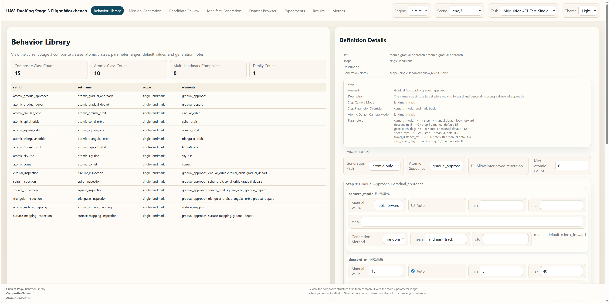

*Stage 3 behavior library. This page presents the hierarchical relation between composite inspection classes and atomic motion primitives before trajectory generation begins.*

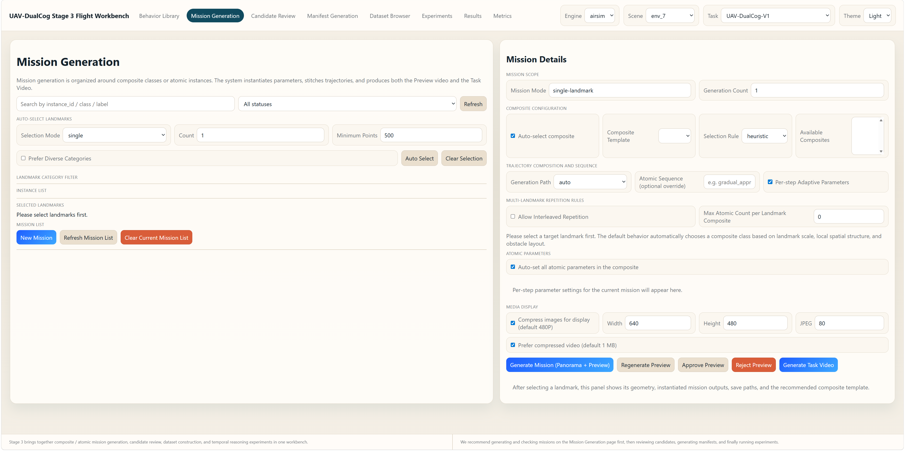

*Stage 3 mission generation. Reviewers select landmarks, mission families, and generation options here, then render panorama, preview, or final task videos for interactive spot checks.*

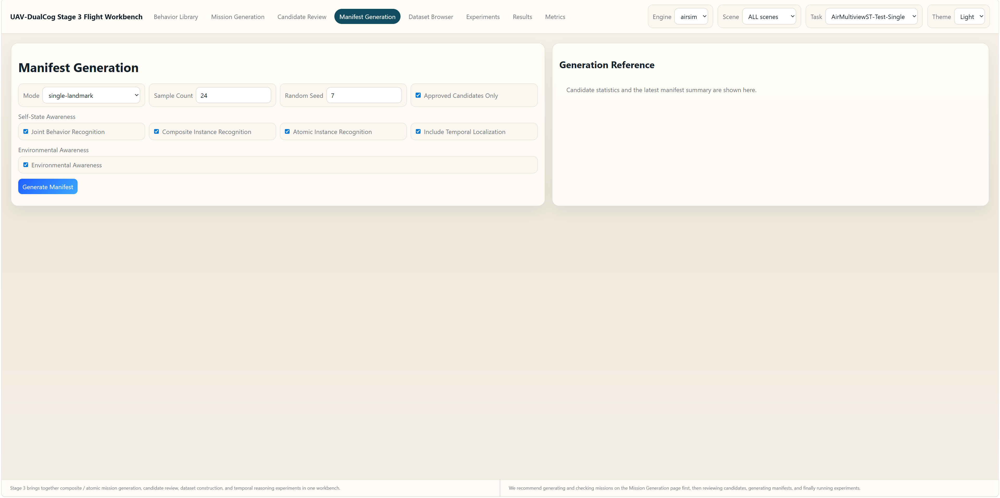

*Stage 3 manifest generation. Approved candidates are converted into benchmark-facing task rows here; the generated manifest can then be inspected in the dataset browser together with sample media and interval labels.*

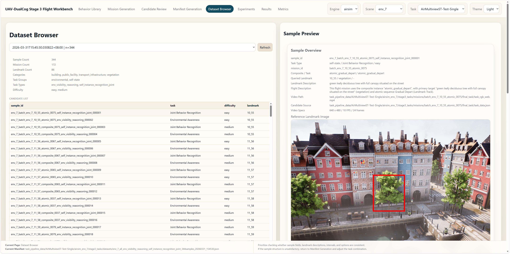

*Stage 3 dataset browser. This page is used to verify reference images, overview boards, sample videos, answer targets, and interval annotations before experiments are launched.*

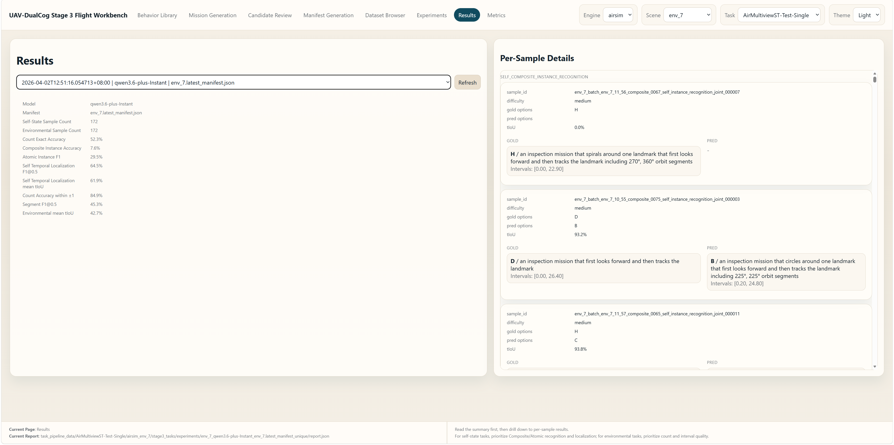

*Stage 3 results page. Run-level summaries and sample-level predictions are browsed here to distinguish semantic mistakes, parsing failures, and temporal-localization errors.*

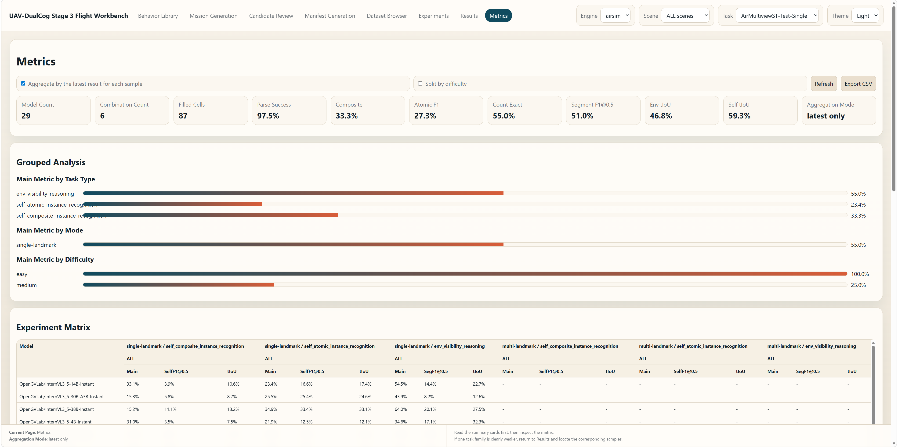

*Stage 3 metrics page. Summary cards, grouped comparisons, full tables, and progress views support quick diagnosis before exporting CSV for offline aggregation.*

### 8.3 Stage 4 Web: Image-QA Generation, Manifest Browsing, And Evaluation

Launch:

```bash
python scripts/uav_dualcog/stage4_qa_generate_and_eval.py \
  --config configs/uav_dualcog/task_airsim_env_7.yaml \
  --scene-id env_7 \
  --mode web \
  --port 20264
```

The Stage 4 workbench is organized around five pages:
- `Generate`
- `Dataset`
- `Experiments`
- `Results`
- `Metrics`

Before treating a page as empty, first switch the top-right scene, task type, manifest, or report
selector. Several Stage 4 pages only render detailed content after an active selection is chosen.

Recommended use of each page:

**Generate**
- Configure task strategy, reference-view definition, task types, category filters, difficulty, and
  sample counts.
- Use the estimator to check how many rows the current choice is likely to produce before actually
  writing a manifest.
- Use this page for interactive validation and spot checks. For released-scale Stage 4 generation,
  we recommend `task_pipeline.py --stage stage4 --phase data/render`.

**Dataset**
- Browse manifest summaries and sample previews.
- Use this page to verify that reference images, query images, answer options, and bbox targets are
  aligned correctly.

**Experiments**
- Select a manifest, choose one or more models, set upload size/quality, concurrency, and limits,
  then launch jobs.
- Use this page for **small to medium comparative runs** and prompt/debug checks.
- For released-scale benchmark runs and comparative sweeps, we recommend
  `task_pipeline.py --stage stage4 --phase experiment`.

**Results**
- Open a report and inspect per-sample outputs.
- Use this page to confirm whether an error comes from option selection, bbox grounding, or parser
  failure.

**Metrics**
- View summary cards, grouped comparisons, the experiment matrix, and progress tables.
- Export CSV for downstream analysis when needed.

Operational recommendation:
- Use the Stage 4 web to validate manifest quality and inspect experiment outputs qualitatively.
- Use `task_pipeline.py --stage stage4 --phase selection/data/render/experiment` when you need
  released-scale batch generation or large model sweeps.

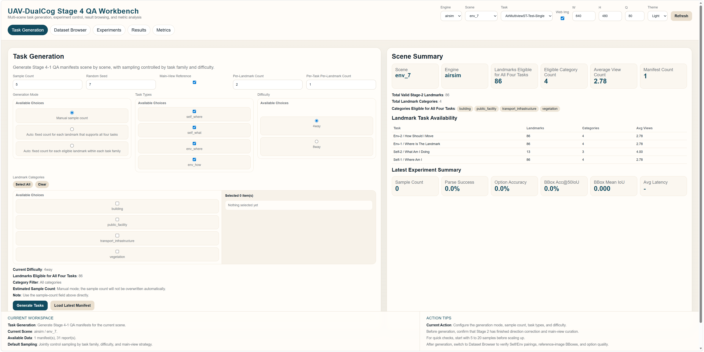

*Stage 4 task generation. Sampling strategy, task types, difficulty settings, and per-landmark limits are configured here before new image-QA manifests are written.*

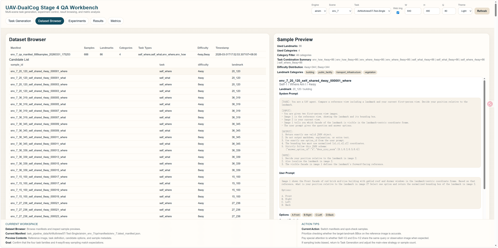

*Stage 4 dataset browser. This page is the fastest place to verify that reference images, query images, option ordering, and bbox targets remain visually aligned.*

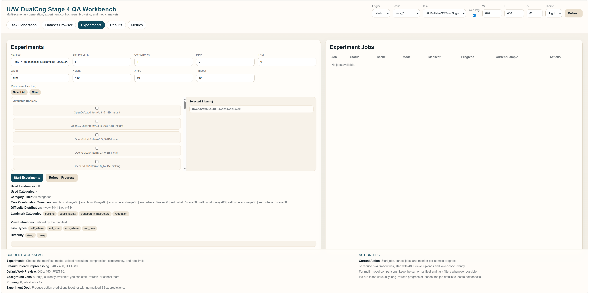

*Stage 4 experiments page. Model aliases, upload settings, concurrency, and rate limits are managed here for qualitative reruns and small-to-medium comparison jobs.*

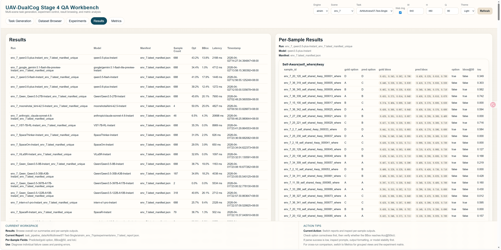

*Stage 4 results page. Per-run summaries and sample-level outputs make it easy to inspect whether a failure comes from option selection, bbox grounding, or parser behavior.*

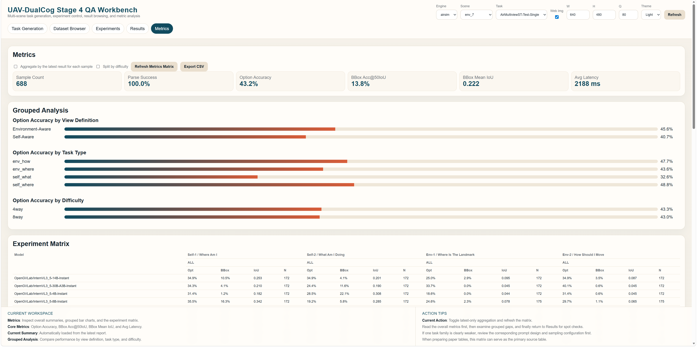

*Stage 4 metrics page. Summary cards, grouped comparisons, experiment matrices, and progress tables provide a compact view of image-task evaluation quality.*

## 9) Executable Steps (Mode B: Experiment)

Purpose: run model evaluation on released task manifests without redoing scene construction.

```bash
# Stage 3 experiments
python scripts/uav_dualcog/task_pipeline.py \
  --spec configs/uav_dualcog/task_pipeline/task_pipeline_uav_dualcog_v1.yaml \
  --stage stage3 --phase experiment \
  --experiment-models openai/gpt-5.3-chat Qwen/Qwen3.5-9B-Instant

# Stage 4 experiments
python scripts/uav_dualcog/task_pipeline.py \
  --spec configs/uav_dualcog/task_pipeline/task_pipeline_uav_dualcog_v1.yaml \
  --stage stage4 --phase experiment \
  --experiment-models openai/gpt-5.3-chat Qwen/Qwen3.5-4B-Thinking
```

If you only want to verify interface wiring (without real model calls), use `--help` on stage/pipeline scripts and validate config parsing paths first.

## 10) Smoke-Test Commands (Reviewer Quick Check)

```bash
python scripts/uav_dualcog/stage1_collect_pcd.py --help
python scripts/uav_dualcog/stage2_landmark_label.py --help
python scripts/uav_dualcog/probe_airsim_mapbound.py --help
python scripts/uav_dualcog/stage3_generate_traj.py --help
python scripts/uav_dualcog/stage4_qa_generate_and_eval.py --help
python scripts/uav_dualcog/task_pipeline.py --help
python scripts/uav_dualcog/mock_api_runtime_check.py --config configs/uav_dualcog/common_api_runtime.yaml
```

These checks confirm runnable CLI interfaces before launching long construction or experiment jobs.

## Citing
If you use FineCog-Nav in your research, please cite the following paper:

```
@misc{liu2026uavdualcog,
      title={Knowing the Self, Understanding the World: A Dual-Cognition Benchmark for UAV Spatio-temporal Reasoning with MLLMs}, 
      author={Like Liu and Zhengzheng Xu and Haitao He and Hongzhe Li and Shuchang Zhang and Dian Shao},
      year={2026},
      eprint={2607.16193},
      archivePrefix={arXiv},
      primaryClass={cs.CV},
      url={https://arxiv.org/abs/2607.16193}, 
}
```

## Acknowledgement

Some components modified from [AerialVLN](https://github.com/AirVLN/AirVLN) and [OpenFly](https://github.com/SHAILAB-IPEC/OpenFly-Platform). Thanks sincerely.
